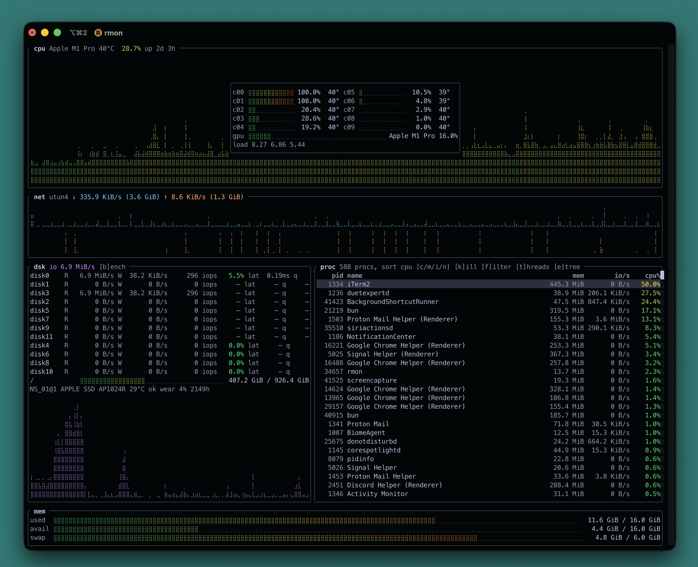

rmon

Terminal system monitor with disk benchmarking.

Written in Rust. Panels for cpu (per-core usage and temperature, even
across hyperthread siblings), gpu (utilization graph, shown only when
the host has one), network, disks (per-disk io, mounts, smart health),
processes, and memory (used, available, swap).

The network panel gives every interface its own row with live rx/tx
rates and inline history graphs. Interfaces appear when they carry
traffic and hide again after 5 idle seconds; disks work the same way.
The h key shows the hidden rows, and both lists scroll when they
overflow.

The process panel sorts by cpu, memory, io, or name, filters live as
you type, shows per-process threads, and lays processes out as a
parent/child tree. Selected rows stay pinned on screen while the list
resorts. Full mouse support: wheel scroll, click to select, draggable
scrollbars. Selected processes can be sent SIGTERM after a
confirmation prompt.

The disk benchmark measures sequential read/write MB/s and random 4k
iops with p50/p99 latency, using direct io where the os allows it.
Results append to ~/.rmon/bench_history.jsonl. A read-only raw device
test is available behind --device.

Runs on Linux and macOS.

usage:

    rmon
    rmon bench [--path DIR | --device DEV] [--size-mb N] [--secs N]

keys:

    q           quit
    up/down     move selection
    c/m/i/n     sort procs by cpu, memory, io, name
    f or /      filter procs (enter keeps it, esc clears it)
    t           show threads of the selected process
    e           process tree view
    h           show idle interfaces and disks
    k           kill selected process (y/enter confirms)
    b           run disk benchmark
    s           system info popup (neofetch style)
    + / -       slow down / speed up the refresh (100ms..10s)
    mouse       wheel scrolls, click selects, scrollbars drag
